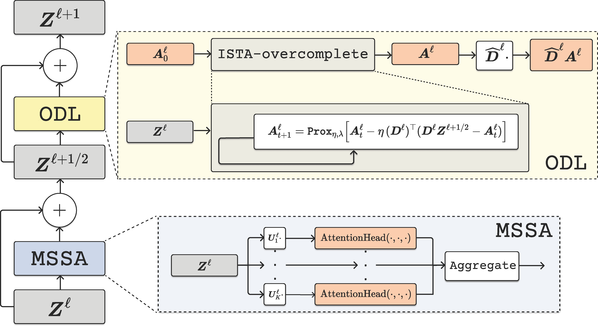
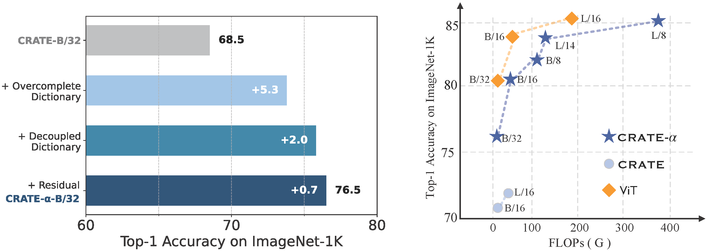
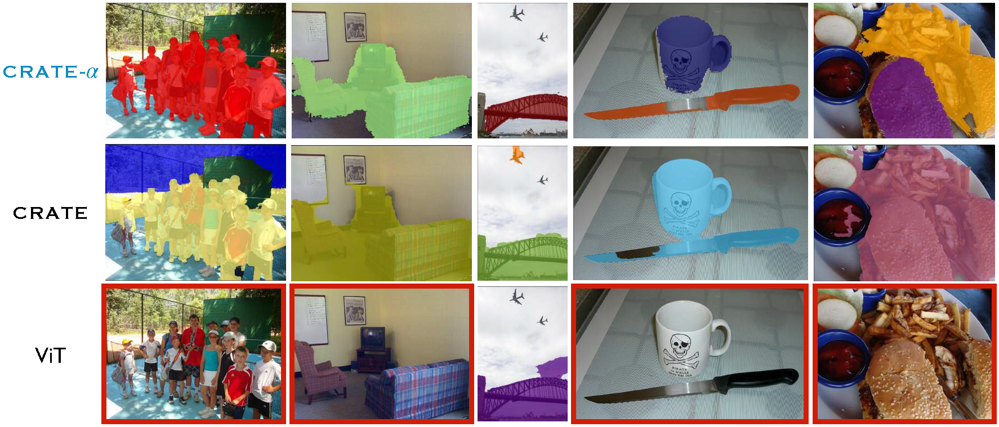

# Scaling White-Box Transformers for Vision

This repo contains official JAX implementation of CRATE-alpha in our paper: [Scaling White-Box Transformers for Vision]()

We propose **CRATE-α**, featuring strategic yet minimal modifications to the sparse coding block in the **CRATE** architecture design, and a light training recipe designed to improve the scalability of **CRATE**.

<p align="center">
  
   One layer of the CRATE-α model architecture. 
   <span class="math">MSSA</span> (<strong>M</strong>ulti-head <strong>S</strong>ubspace <strong>S</strong>elf-<strong>A</strong>ttention) represents the compression block, and <tt>ODL</tt> (<strong>O</strong>vercomplete <strong>D</strong>ictionary <strong>L</strong>earning) represents the sparse coding block.
</p>


## Comparison of CRATE, CRATE-α, and ViT

<p align="center">
  
  <i>Left:</i> We demonstrate how modifications to the components enhance the performance of the <b>CRATE</b> model on ImageNet-1K. <i>Right:</i> We compare the FLOPs and accuracy on ImageNet-1K of our methods with ViT <a href="https://arxiv.org/abs/2010.11929">Dosovitskiy et al., 2020</a> and CRATE <a href="https://ma-lab-berkeley.github.io/CRATE/">Yu et al., 2023</a>. CRATE is trained only on ImageNet-1K, while <b>ours</b> and ViT are pre-trained on ImageNet-21K.
</p>


## Visualize the Improvement of Semantic Interpretability of **CRATE-α**.

<p align="center">
  
  <strong>Visualization of segmentation on COCO val2017 <a href="https://arxiv.org/abs/1405.0312">Lin et al., 2014</a> with MaskCut <a href="https://arxiv.org/abs/2301.11320">Wang et al., 2023</a>.</strong>  
  <em>Top row</em>: Supervised <strong>ours</strong> effectively identifies the main objects in the image. Compared with <strong>CRATE</strong> (<em>Middle row</em>), <strong>ours</strong> achieves better segmentation performance in terms of boundary.
  <em>Bottom row</em>: Supervised ViT fails to identify the main objects in most images. We mark failed images with .
</p>


## Experimental Results


| Models (Base)             | ImageNet-1K(%) |  | Models (Large)             | ImageNet-1K(%) |
|---------------------------|----------------|--|-----------------------------|----------------|
| CRATE-α-B/32              | 76.5           |  | CRATE-α-L/32                | 80.2           |
| CRATE-α-B/16              | 81.2           |  | CRATE-α-L/14                | 83.9           |
| CRATE-α-B/8               | 83.2           |  | CRATE-α-L/8                 | 85.1           |


## Download Model Weights

You can download model weights from the following link: [Model Weights](https://huggingface.co/UCSC-VLAA/CRATE-alpha/tree/main/jax)


## TPU Usage and Environment Installation

### TPU Usage

Our experiments are conducted on TPUs. How can we gain access to and set up TPU machines? Check this [brief doc](https://github.com/UCSC-VLAA/CLIPA/blob/master/TPU_USAGE.md) in [CLIPA](https://github.com/UCSC-VLAA/CLIPA).

### Environment Installation

To set up the environment, run the following script:

```bash
bash scripts/env/setup_env.sh
```

## Training

### Classification Training

We provide scripts for pre-training on ImageNet-21K and fine-tuning on ImageNet-1K.

#### Pre-training on ImageNet-21K

To start pre-training on ImageNet-21K, run:

```bash
bash scripts/in1k/pre_training_in21k.sh
```

#### Fine-tuning on ImageNet-1K

To start fine-tuning on ImageNet-1K, run:

```bash
bash scripts/in1k/fine_tuning_in1k.sh
```

### Vision-Language Contrastive Learning Training

We provide scripts for pre-training and fine-tuning on Datacomp1B.

#### Pre-training on Datacomp1B

To start pre-training on Datacomp1B, run:

```bash
bash scripts/clipa/pre_train.sh
```

#### Fine-tuning on Datacomp1B

To start fine-tuning on Datacomp1B, run:

```bash
bash scripts/clipa/fine_tune.sh
```


## PyTorch Inference 

To increase accessibility, we have converted the weights from JAX to PyTorch. We provide models in configurations B/16, L/14, CRATE-α-CLIPA-L/14, and CRATE-α-CLIPA-H/14. You can use the PyTorch code to reproduce the results from our paper.

### Preparing ImageNet-1K Validation Set

You can download the ImageNet-1K validation set using the following commands:

```bash
wget https://image-net.org/data/ILSVRC/2012/ILSVRC2012_img_val.tar 
wget https://image-net.org/data/ILSVRC/2012/ILSVRC2012_devkit_t12.tar.gz
```

###  Dependencies

For the PyTorch environment, the recommended dependencies are as follows:

```
pip install torch==2.0.0
pip install torchvision==0.15.0
pip install transformers==4.40.2
pip install open-clip-torch==2.24.0
```


### Reproducing Results on ImageNet-1K with PyTorch 

| Model                     | PyTorch Accuracy | JAX (Paper) Accuracy | PyTorch Weights                           |
|---------------------------|------------------|---------------------|-------------------------------------------|
| CRATE-α-B/16              | 81.2             | 81.2                | [Download](https://huggingface.co/UCSC-VLAA/CRATE-alpha/blob/main/torch/crate_alpha_B16.pth) |
| CRATE-α-L/14              | 83.9             | 83.9                | [Download](https://huggingface.co/UCSC-VLAA/CRATE-alpha/blob/main/torch/crate_alpha_L14.pth) |
| CRATE-α-CLIPA-L/14              | 69.8             | 69.8                | [Download](https://huggingface.co/UCSC-VLAA/CRATE-alpha/blob/main/torch/crate_alpha_CLIPA_L14.pth) |
| CRATE-α-CLIPA-H/14              | 72.3             | 72.3                | [Download](https://huggingface.co/UCSC-VLAA/CRATE-alpha/blob/main/torch/crate_alpha_CLIPA_H14.pth) |


### PyTorch Weights

Weights for the PyTorch models are available for download. Use the links provided in the table above.

### Classification

To run the evaluation code, specify the path to the checkpoints and the ImageNet validation set in the `eval_in1k_cls.py` file.

```bash
python torch_inference/eval_in1k_cls.py
```

### Zero-Shot on ImageNet-1K

For the CLIPA PyTorch version, we refer to [CLIP](https://github.com/openai/CLIP).

To run the evaluation code, specify the path to the checkpoints and the ImageNet validation set in the `eval_in1k.py` and `clipa_model.py` files. The default model is CRATE-α-CLIPA-L/14.

```bash
python torch_inference/eval_in1k.py
```


## Acknowledgement

The repo is built on [big vision](https://github.com/google-research/big_vision) and [CLIPA](https://github.com/UCSC-VLAA/CLIPA). Many thanks to the awesome works from the open-source community!


We are also very grateful that this work is supported by a gift from Open Philanthropy, TPU Research Cloud (TRC) program, and Google Cloud Research Credits program.


## Citation

```

```

## Contact
If you have any questions, please feel free to raise an issue or contact us directly: jyang347@ucsc.edu.
